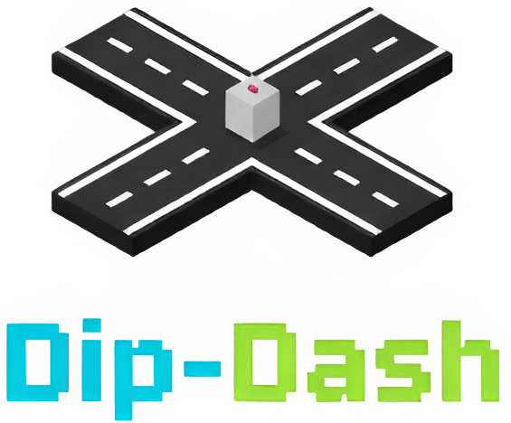
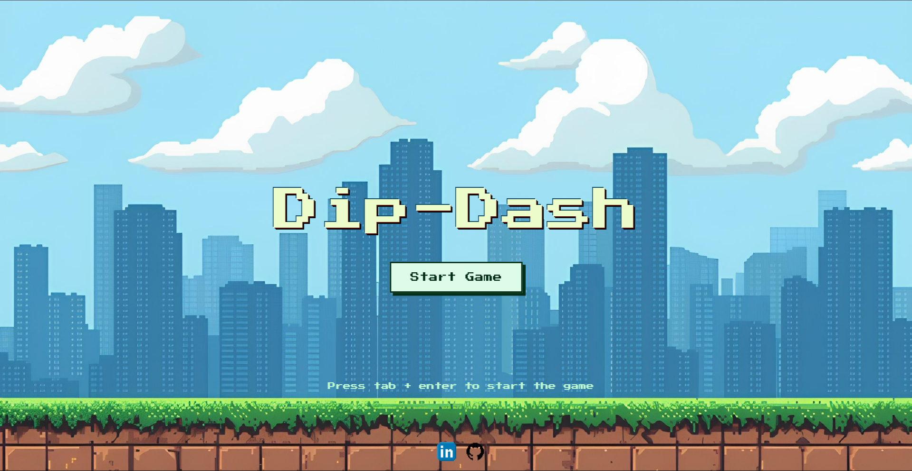
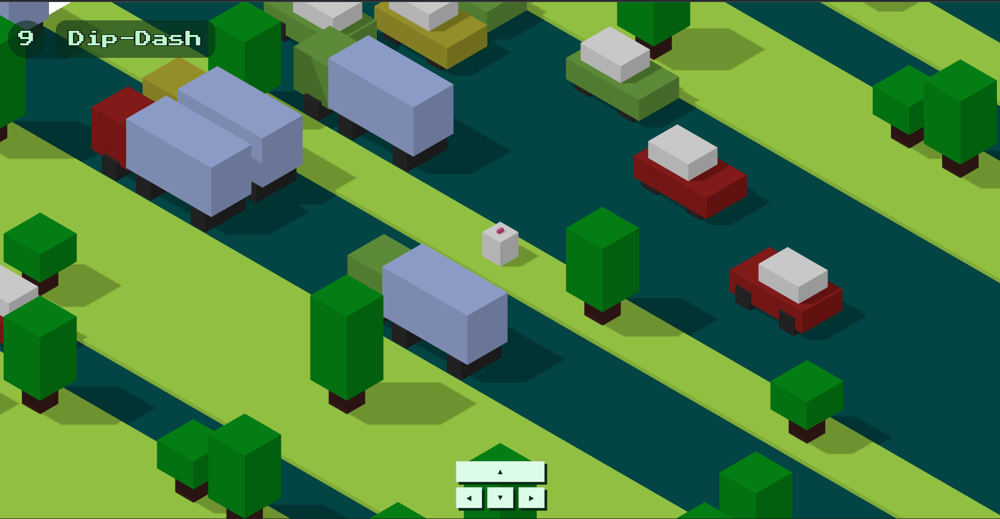

<div align="center">
  

  **An endless road-crossing adventure in a vibrant 3D world built using Three.js**
  
[](https://dipdash.netlify.app)
  
</div>

---

<div align="center">
  
  
</div>

---

## ◾Features

- **Classic Gameplay**: Simple, addictive, and easy-to-learn mechanics.
- **Dynamic World**: A procedurally generated map that grows as you play.
- **Obstacles**: Dodge oncoming cars and trucks to stay alive.
- **Pause Functionality**: Press Escape or click the pause button to take a break.
- **Responsive Controls**: Use keyboard arrows or on-screen buttons to move.
- **Progressive Difficulty**: Vehicle speed increases by 15% every 50 levels.Player speed increases after 150 levels to keep up with faster vehicles.
- **Mobile-Friendly**: Fully responsive gameplay experience on phones.

## ◾How to Play

The objective is simple: cross as many roads as you can without getting hit.

- **Keyboard**: Use the arrow keys (▲, ▼, ◀, ▶) or WASD to move your character.
- **On-screen Controls**: Click the corresponding buttons on the screen to move.
- **Pause**: Press the Escape key to stop the game. Esc again to resume.

## ◾Getting Started

### ◾Prerequisites

Make sure you have Node.js and npm installed on your machine.

### ◾Installation

Clone the repository:

```bash
git clone https://github.com/abhaydesu/dip-dash.git
```
Navigate to the project directory:

```bash
cd dip-dash
```

Install the dependencies:

```bash
npm install
```

### ◾Running the Game 

To start a local development server and play the game, run the following command:

```bash
npm run dev
```

The game will be available at http://localhost:5173 (or a similar address) in your browser. 

## ◾Project Structure 
The project is structured to keep components organized and maintainable. Here's a brief overview: 
- **src/**: Contains all the game logic and components. 
- **components/**: Houses all the building blocks of the game, such as the Camera, Player, Map, Car, and Truck. 
- **utilities/**: Contains utility functions for things like calculating positions and generating rows. 
- **main.js**: The main entry point of the application, where the game loop is set up and all components are initialized.